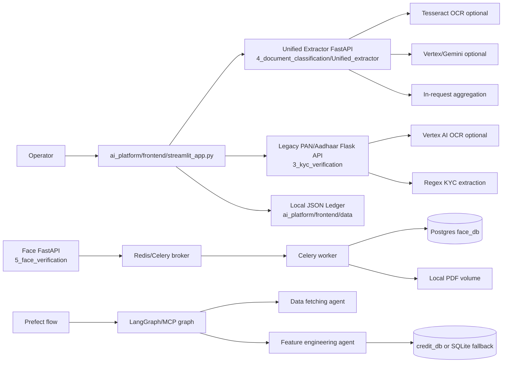
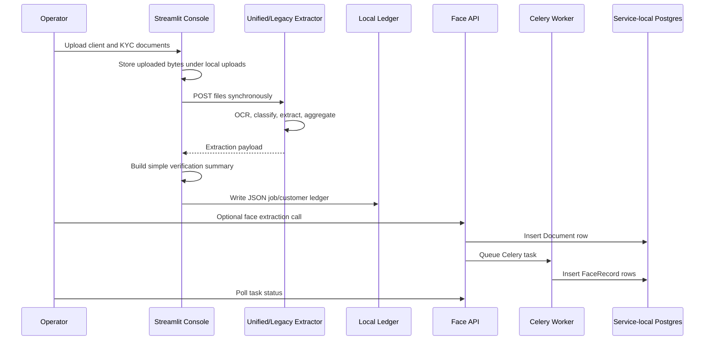
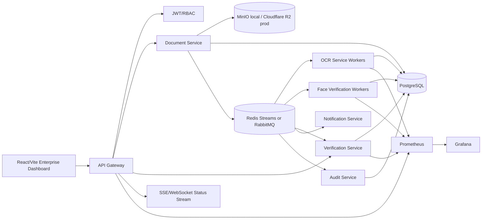
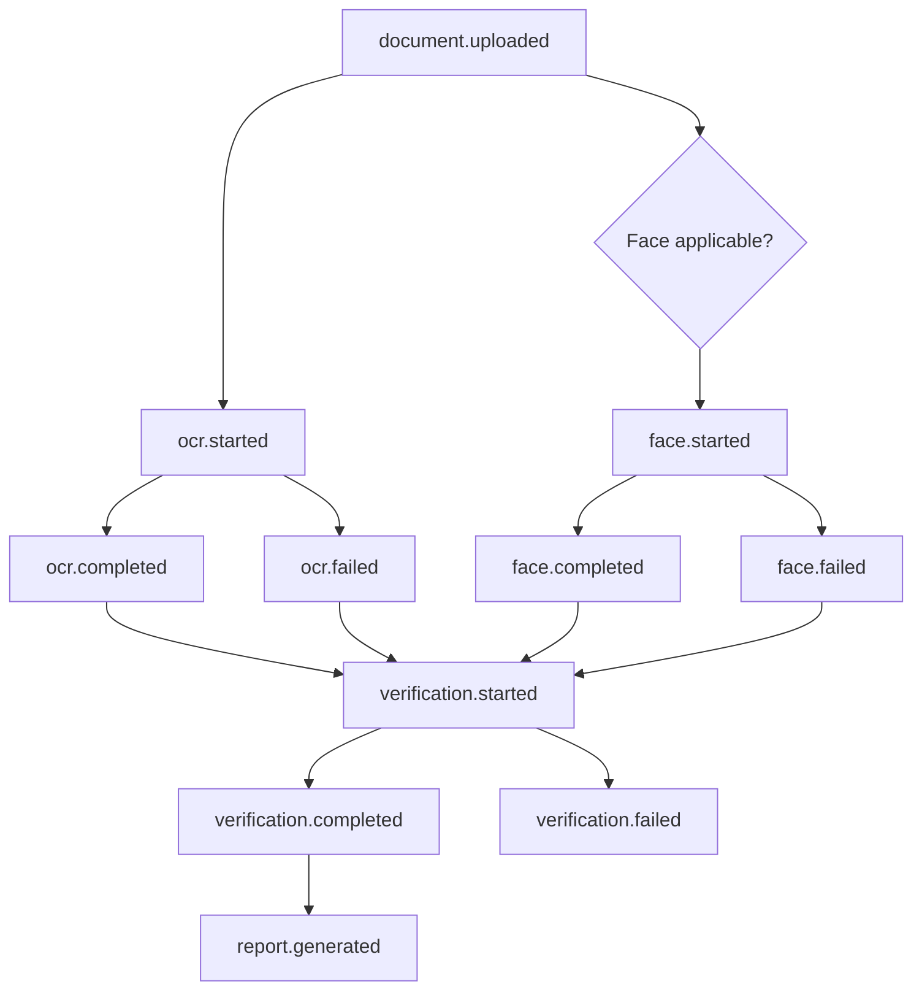

# KYC Document Verification Platform Architecture

## Audit Summary

This repository currently contains several useful but disconnected implementations: a Streamlit operator console, a FastAPI unified extractor, a legacy Flask PAN/Aadhaar OCR API, a FastAPI/Celery face service, Prefect/LangGraph orchestration experiments, and shared `ai_platform` contract scaffolding. It does not yet contain the requested React/Vite/Tailwind frontend, API gateway, single durable job model, object-storage abstraction, database migrations, real-time status stream, or complete Docker environment.

The target system should be built incrementally from the existing strongest modules, with the current extractors and face worker wrapped behind stable service contracts before any broad rewrite.

## Current Architecture

## Current Data Flow

## Current Service Dependency Diagram

```mermaid
flowchart TD
    Streamlit --> Requests[requests]
    Streamlit --> LocalFiles[local filesystem]
    UnifiedExtractor --> FastAPI
    UnifiedExtractor --> Pydantic
    UnifiedExtractor --> Pillow
    UnifiedExtractor --> PDF2Image
    UnifiedExtractor --> Tesseract
    UnifiedExtractor --> VertexAI
    LegacyOCR --> Flask
    LegacyOCR --> GoogleVision
    LegacyOCR --> OpenCV
    FaceService --> FastAPI
    FaceService --> SQLModel
    FaceService --> Postgres
    FaceService --> Redis
    FaceService --> Celery
    FaceService --> DeepFace
    FaceService --> PyMuPDF
    FaceService --> LocalDisk
    PrefectFlow --> Prefect
    PrefectFlow --> LangGraph
    PrefectFlow --> Feast
    PrefectFlow --> SQLAlchemy
```

## Desired Architecture

The desired platform should expose one external API gateway and route work to domain services through events and queues. Services may begin as modules in one repository, but their boundaries should be explicit so they can later be deployed independently.

## Desired Backend Boundaries

| Service | Responsibilities | Current source to wrap | Target persistence |
| --- | --- | --- | --- |
| API Gateway | Auth, routing, upload coordination, OpenAPI, rate limiting, status stream | New FastAPI service using `ai_platform.contracts` | PostgreSQL sessions and job reads |
| Document Service | Upload validation, metadata, versioning, object storage | New service; reuse `kyc_gateway.document_hash` | `documents`, `document_versions` |
| OCR Service | OCR and entity extraction | `4_document_classification/Unified_extractor`, legacy PAN/Aadhaar regex | `ocr_results`, events |
| Face Verification Service | Face extraction and comparison | `5_face_verification/face_verification_pipeline` | `face_results`, events |
| Verification Service | Name/DOB/address/ID/entity matching, scoring, report generation | `build_verification_summary`, unified schemas | `verification_results` |
| Notification Service | Status fan-out to SSE/WebSocket and optional email/webhook | New | `processing_events` |
| Audit Service | Immutable audit logs and security events | New | `audit_logs` |

## Desired Queue Flow

## Frontend Target

The requested frontend does not exist in the current workspace. The target should be a new React/Vite/TypeScript app with Tailwind, shadcn/ui, TanStack Query, React Hook Form, Zod, dark mode, error boundaries, skeletons, toasts, and accessible responsive layouts.

Required pages:

- Dashboard
- Upload KYC
- Upload Supporting Documents
- Verification Status
- Verification Results
- Audit History
- Settings

## Database Target

Use one PostgreSQL schema with UUID primary keys, foreign keys, soft deletes, status/event history, and indexes for user, job, document, event, and result lookups. `schema.sql` is the proposed migration baseline.

## Storage Target

Documents must be stored outside PostgreSQL. The application should use a storage interface with these implementations:

- Local development: MinIO using S3-compatible API.
- Production: Cloudflare R2 using S3-compatible API.

PostgreSQL stores metadata, object keys, checksums, content type, size, version, and retention flags only.

## Observability Target

Every service should emit structured JSON logs with `trace_id`, `job_id`, `document_id`, `service`, `event_type`, `duration_ms`, and `status`. Prometheus should scrape service health/metrics. OpenTelemetry traces should connect gateway requests to queue jobs and worker execution.

## Architecture Risks

- Current code mixes synchronous request processing with long-running OCR/LLM work.
- There is no authoritative job state machine.
- Current queues are only partially used by the face service.
- Local disk storage prevents reliable cloud deployment.
- Current frontend is Streamlit, not the requested React enterprise dashboard.
- Secrets and generated data are present in the repository.
- Dependency sets are unpinned or conflicting.
- Docker Compose is fragmented and incomplete.
