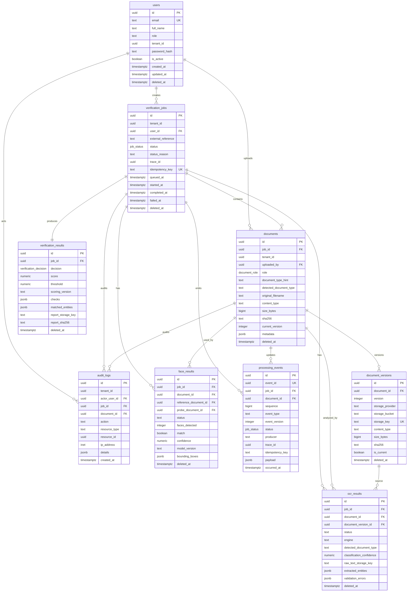

# Entity Relationship Diagram

## Notes

- `documents` store metadata only; bytes live in MinIO locally or Cloudflare R2 in production.
- `document_versions` enables re-upload, preprocessed variants, and immutable object pointers.
- `processing_events` supports real-time SSE/WebSocket replay and auditability.
- Soft deletes are included on user-facing mutable tables. Audit logs are append-only.
